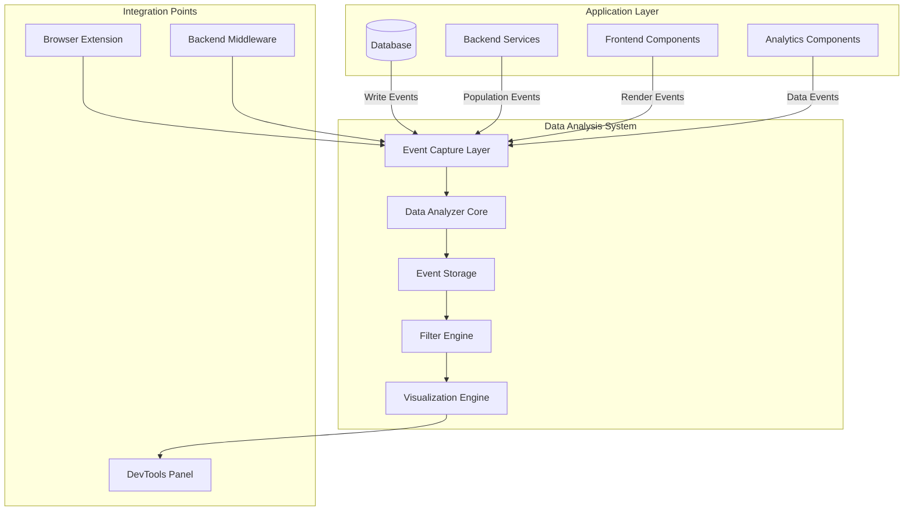

# Data Analysis and Visualization - Design Document

## Overview

The Data Analysis and Visualization feature provides developers with comprehensive debugging capabilities to understand data flow through their applications. The system captures data population events across the full stack (database, backend, frontend), visualizes data flow paths, and provides real-time monitoring with filtering and export capabilities.

The architecture consists of three main components:

1. **Data Analyzer**: Captures and processes population events from all application layers
2. **Visualization Engine**: Renders data flows, snapshots, and analytics in an intuitive interface
3. **Integration Layer**: Provides browser extensions and backend middleware for seamless integration

The system is designed to minimize performance impact while providing detailed insights into how data moves through the application, with special focus on analytics and dashboard components where data visualization issues commonly occur.

## Architecture

### System Components



### Component Responsibilities

**Event Capture Layer**
- Intercepts data operations at database, backend, and frontend layers
- Generates standardized population events with metadata
- Associates events with request identifiers for tracing
- Implements configurable capture levels (minimal, standard, detailed)

**Data Analyzer Core**
- Processes and enriches captured events
- Identifies analytics components and their data requirements
- Detects data mismatches and schema violations
- Calculates performance overhead metrics
- Manages sensitive data masking

**Event Storage**
- Maintains in-memory buffer for real-time events
- Implements circular buffer with configurable size
- Supports event persistence for export
- Provides efficient querying by component, time range, and content

**Filter Engine**
- Supports filtering by component name, time range, and data content
- Combines multiple filter criteria with AND logic
- Implements efficient indexing for fast queries
- Handles sampling for high-volume event streams

**Visualization Engine**
- Renders data flow paths with timing information
- Displays data snapshots with syntax highlighting
- Shows diff views between snapshots
- Provides real-time updates with sub-500ms latency
- Generates summary reports for analytics components

### Data Flow

1. **Capture Phase**: Application operations trigger event capture at integration points
2. **Processing Phase**: Analyzer enriches events with metadata and applies masking
3. **Storage Phase**: Events are stored in indexed buffer for querying
4. **Query Phase**: Filter engine processes developer queries
5. **Visualization Phase**: Engine renders results in DevTools panel

## Components and Interfaces

### Event Capture Layer

**Interface: EventCapture**

```typescript
interface PopulationEvent {
  id: string;
  requestId: string;
  timestamp: number;
  layer: 'database' | 'backend' | 'frontend';
  eventType: 'write' | 'read' | 'render' | 'transform';
  source: string;
  data: any;
  metadata: EventMetadata;
}

interface EventMetadata {
  componentName?: string;
  tableName?: string;
  operationType?: string;
  stackTrace?: string[];
  dataSize: number;
  captureLevel: 'minimal' | 'standard' | 'detailed';
}

interface EventCapture {
  captureEvent(event: PopulationEvent): void;
  setCaptureLevel(level: 'minimal' | 'standard' | 'detailed'): void;
  pause(): void;
  resume(): void;
  getBufferedEvents(): PopulationEvent[];
}
```

**Database Capture**
- Hooks into ORM or database driver
- Captures INSERT, UPDATE, DELETE operations
- Records table name, operation type, affected rows
- Minimal overhead: records only metadata at minimal level

**Backend Capture**
- Middleware intercepts request/response cycle
- Captures data transformations and API responses
- Associates events with request ID from headers
- Configurable to capture specific routes or all routes

**Frontend Capture**
- Browser extension injects capture code
- Monitors component renders and state updates
- Tracks data received by analytics components
- Uses MutationObserver for DOM changes

### Data Analyzer Core

**Interface: DataAnalyzer**

```typescript
interface DataFlowPath {
  requestId: string;
  events: PopulationEvent[];
  startTime: number;
  endTime: number;
  layers: string[];
}

interface DataSnapshot {
  eventId: string;
  timestamp: number;
  data: any;
  schema?: object;
  masked: boolean;
}

interface AnalyticsComponentInfo {
  name: string;
  expectedSchema: object;
  actualData: any;
  mismatches: SchemaMismatch[];
  lastUpdated: number;
}

interface SchemaMismatch {
  field: string;
  expected: string;
  actual: string;
  severity: 'error' | 'warning';
}

interface DataAnalyzer {
  getDataFlowPath(requestId: string): DataFlowPath;
  getSnapshot(eventId: string): DataSnapshot;
  compareSnapshots(id1: string, id2: string): SnapshotDiff;
  identifyAnalyticsComponents(): AnalyticsComponentInfo[];
  analyzeComponent(name: string): AnalyticsComponentInfo;
  maskSensitiveData(data: any, config: MaskingConfig): any;
  getPerformanceOverhead(): PerformanceMetrics;
}
```

**Analytics Component Detection**
- Scans component tree for dashboard/chart components
- Identifies components by naming patterns or annotations
- Extracts expected data schemas from prop types or TypeScript interfaces
- Compares actual data received against expected schema

**Data Masking**
- Default sensitive field patterns: password, token, ssn, credit_card, api_key
- Configurable field list via settings
- Shows data type and length: `"password": "[string, 16 chars]"`
- Unmask requires explicit confirmation dialog

**Performance Monitoring**
- Tracks time spent in capture and analysis
- Calculates overhead as percentage of total execution time
- Provides per-layer breakdown (database, backend, frontend)
- Alerts when overhead exceeds configurable threshold

### Filter Engine

**Interface: FilterEngine**

```typescript
interface FilterCriteria {
  componentName?: string;
  timeRange?: { start: number; end: number };
  dataContent?: string;
  layer?: 'database' | 'backend' | 'frontend';
  eventType?: string;
}

interface FilterEngine {
  filter(criteria: FilterCriteria): PopulationEvent[];
  search(query: string): PopulationEvent[];
  combineFilters(criteria: FilterCriteria[]): PopulationEvent[];
  enableSampling(rate: number): void;
  isSampling(): boolean;
}
```

**Filtering Strategy**
- Component filter: exact match on componentName or tableName
- Time range filter: binary search on timestamp index
- Content filter: JSON string search with partial matching
- Combined filters: apply sequentially, short-circuit on empty results

**Sampling**
- Activates automatically when event rate > 100/second
- Uses reservoir sampling to maintain representative sample
- Displays sampling indicator in UI
- Configurable sample size (default: 1000 events)

### Visualization Engine

**Interface: VisualizationEngine**

```typescript
interface DataFlowVisualization {
  requestId: string;
  nodes: FlowNode[];
  edges: FlowEdge[];
  highlightedComponents: string[];
}

interface FlowNode {
  id: string;
  layer: string;
  componentName: string;
  timestamp: number;
  data: any;
}

interface FlowEdge {
  from: string;
  to: string;
  transformationType?: string;
  duration: number;
}

interface SnapshotDiff {
  added: object;
  removed: object;
  modified: object;
}

interface VisualizationEngine {
  renderDataFlow(path: DataFlowPath): DataFlowVisualization;
  renderSnapshot(snapshot: DataSnapshot): string;
  renderDiff(diff: SnapshotDiff): string;
  updateRealtime(event: PopulationEvent): void;
  generateSummaryReport(components: AnalyticsComponentInfo[]): string;
}
```

**Rendering Strategy**
- Data flow: directed graph with time-based layout
- Snapshots: JSON with syntax highlighting and collapsible sections
- Diffs: side-by-side view with color-coded changes (green=added, red=removed, yellow=modified)
- Real-time: incremental DOM updates, debounced to 500ms

**Visual Indicators**
- Analytics components highlighted in blue
- Data mismatches shown with warning icons
- Masked fields displayed with lock icon
- Sampling active shown with indicator badge

## Data Models

### PopulationEvent

```typescript
interface PopulationEvent {
  id: string;                    // UUID for event
  requestId: string;             // Trace ID across layers
  timestamp: number;             // Unix timestamp in ms
  layer: 'database' | 'backend' | 'frontend';
  eventType: 'write' | 'read' | 'render' | 'transform';
  source: string;                // Component/table/function name
  data: any;                     // Captured data payload
  metadata: EventMetadata;
}
```

**Constraints**:
- `id` must be unique across all events
- `requestId` must be consistent for events in same request flow
- `timestamp` must be monotonically increasing within a request
- `data` may be null for minimal capture level

### EventMetadata

```typescript
interface EventMetadata {
  componentName?: string;        // Frontend component name
  tableName?: string;            // Database table name
  operationType?: string;        // SQL operation or HTTP method
  stackTrace?: string[];         // Call stack (detailed level only)
  dataSize: number;              // Size in bytes
  captureLevel: 'minimal' | 'standard' | 'detailed';
}
```

**Capture Level Details**:
- **Minimal**: Only timestamp, source, componentName, dataSize
- **Standard**: Adds data payload, operationType
- **Detailed**: Adds stackTrace, full metadata

### DataFlowPath

```typescript
interface DataFlowPath {
  requestId: string;
  events: PopulationEvent[];     // Ordered by timestamp
  startTime: number;             // First event timestamp
  endTime: number;               // Last event timestamp
  layers: string[];              // Unique layers involved
}
```

**Invariants**:
- `events` must be sorted by timestamp
- `startTime` equals `events[0].timestamp`
- `endTime` equals `events[events.length - 1].timestamp`
- `layers` contains unique values from `events.map(e => e.layer)`

### AnalyticsComponentInfo

```typescript
interface AnalyticsComponentInfo {
  name: string;                  // Component identifier
  expectedSchema: object;        // Expected data structure
  actualData: any;               // Last received data
  mismatches: SchemaMismatch[];  // Schema violations
  lastUpdated: number;           // Last data update timestamp
}
```

**Schema Comparison**:
- Compare keys: missing keys are errors, extra keys are warnings
- Compare types: type mismatches are errors
- Nested objects compared recursively
- Arrays checked for element type consistency

### MaskingConfig

```typescript
interface MaskingConfig {
  sensitiveFields: string[];     // Field names to mask
  patterns: RegExp[];            // Regex patterns for field names
  showType: boolean;             // Show data type when masked
  showLength: boolean;           // Show length when masked
}
```

**Default Patterns**:
- `/password/i`
- `/token/i`
- `/api[_-]?key/i`
- `/secret/i`
- `/ssn/i`
- `/credit[_-]?card/i`

### PerformanceMetrics

```typescript
interface PerformanceMetrics {
  totalOverhead: number;         // Total time in ms
  overheadPercentage: number;    // Percentage of app execution
  byLayer: {
    database: number;
    backend: number;
    frontend: number;
  };
  eventCount: number;
  averageEventTime: number;      // Average processing time per event
}
```

