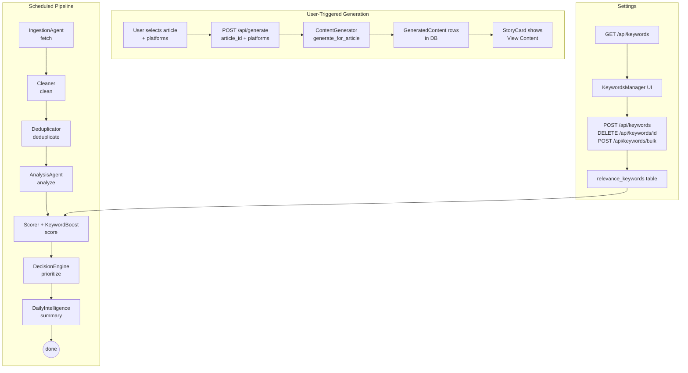

# Design Document: Pipeline / Content Decoupling

## Overview

AI Pulse Pro currently runs a monolithic pipeline that fetches, analyzes, **and** auto-generates social
content for all 8 platforms in a single scheduled run. This produces up to 400 simultaneous LLM calls,
trips circuit breakers, and fills the database with `system_fallback` placeholder content the user
never requested.

This design decouples the system into two independent concerns:

1. **Automated Analysis Pipeline** — scheduled; fetches, cleans, deduplicates, analyzes, and scores
   every fetched article. Stops there. No generation, no scheduling.
2. **User-Triggered Content Generation** — the user browses the scored feed, picks an article, selects
   platforms, and clicks Generate. Content is created only for the chosen platforms.

Supporting changes:
- A configurable keyword list stored in the database boosts article relevance scores.
- A new Keywords tab in Settings provides full CRUD for that list.
- The `ANALYSIS_LIMIT` default changes from 50 → 0 (meaning "analyze all").

---

## Architecture

### High-Level Flow



### Pipeline Stage Comparison

| Stage | Before | After |
|---|---|---|
| fetch | ✅ | ✅ |
| clean | ✅ | ✅ |
| deduplicate | ✅ | ✅ |
| analyze | ✅ (capped at 50) | ✅ (all, or ANALYSIS_LIMIT) |
| score | ✅ | ✅ + keyword boost |
| **generate** | **✅ auto** | **❌ removed** |
| **schedule** | **✅ auto** | **❌ removed** |
| summary | ✅ | ✅ |

---

## Components and Interfaces

### 1. `MultiAgentOrchestrator` (backend/agents/orchestrator.py)

**Change:** Remove the `generate` and `schedule` stages from `run_full_pipeline`.

```python
# BEFORE — stages: fetch → analyze → generate → schedule → summary
# AFTER  — stages: fetch → analyze → score → summary → done

def run_full_pipeline(self, sources: list[str] = None) -> dict:
    # 1. Ingestion
    ingestion_results = self.ingestion.run(sources=sources)
    # 2. Analysis & Scoring
    analysis_results = self.analysis.run()
    # 3. Summary
    summary = decision_engine.generate_daily_summary()
    return {
        "success": True,
        "duration_seconds": ...,
        "ingestion": ingestion_results,
        "analysis": analysis_results,
        "summary": summary,
    }
```

**Removed imports:** `ContentGenerator`, `ContentScheduler`, `CreativeAgent`.

**SSE stage labels emitted:**
`fetch` → `clean` → `deduplicate` → `analyze` → `score` → `summary` → `done`
(never `generate` or `schedule`)

---

### 2. `AnalysisAgent` (backend/agents/analysis_agent.py)

**Change:** Default `ANALYSIS_LIMIT` from `3` → `0` (meaning all).

```python
def run(self, limit: int = None):
    raw_limit = limit if limit is not None else int(getenv("ANALYSIS_LIMIT", "0"))
    # 0 or negative → no cap (analyze all)
    effective_limit = raw_limit if raw_limit > 0 else None
    ...
    processed, raw_ids = self.analyzer.analyze_all_articles(limit=effective_limit)
```

When `ANALYSIS_LIMIT > 0`, the analyzer prioritizes arXiv articles first, then by descending
`fetched_at`, up to the limit.

---

### 3. `RelevanceKeyword` Model (backend/db/models.py)

New SQLAlchemy model added to `models.py`:

```python
class RelevanceKeyword(Base):
    __tablename__ = "relevance_keywords"

    id: Mapped[int] = mapped_column(primary_key=True, autoincrement=True)
    keyword: Mapped[str] = mapped_column(String, unique=True, nullable=False)
    category: Mapped[Optional[str]] = mapped_column(String, nullable=True)
    created_at: Mapped[datetime] = mapped_column(DateTime, default=func.now())
    updated_at: Mapped[datetime] = mapped_column(
        DateTime, default=func.now(), onupdate=func.now()
    )

Index("idx_relevance_keywords_keyword", RelevanceKeyword.keyword)
```

---

### 4. `KeywordRepository` (backend/db/repositories/keyword_repository.py)

New repository providing all keyword persistence operations:

```python
class KeywordRepository:
    def __init__(self, db: Session): ...

    def get_all(self) -> list[RelevanceKeyword]: ...
    def get_by_id(self, keyword_id: int) -> RelevanceKeyword | None: ...
    def add(self, keyword: str, category: str | None) -> RelevanceKeyword: ...
        # raises IntegrityError on duplicate → caller converts to 409
    def delete(self, keyword_id: int) -> bool: ...
        # returns False if not found
    def bulk_add(self, keywords: list[str], category: str | None = None) -> dict:
        # returns {"created": N, "skipped": M}
    def count(self) -> int: ...
    def seed_defaults(self) -> int:
        # inserts DEFAULT_KEYWORDS if table is empty; returns count inserted
```

**Seeding** happens once at app startup (inside `init_db()` or a dedicated `seed_keywords()` call in
`create_app()`). If `relevance_keywords` is empty, `seed_defaults()` is called automatically.

---

### 5. Keyword Scoring Integration (backend/processors/scorer.py)

**Change:** After computing the existing `relevance_score`, apply a keyword boost.

```python
def calculate_keyword_boost(self, title: str, raw_content: str,
                             keywords: list[str]) -> int:
    """Count case-insensitive substring matches across title + raw_content."""
    text = (title + " " + (raw_content or "")).lower()
    matches = sum(1 for kw in keywords if kw.lower() in text)
    if matches == 0:
        return 0
    if matches == 1:
        return 10
    if matches == 2:
        return 20
    if matches == 3:
        return 25
    return 30  # 4+ matches

def calculate_relevance_score(self, row, user_prefs, keywords: list[str] = None) -> int:
    base = <existing logic>          # 0–100
    boost = self.calculate_keyword_boost(
        row.get("title", ""),
        row.get("raw_content", ""),
        keywords or []
    )
    return min(base + boost, 100)
```

`score_all_articles()` loads all keywords once before the scoring loop:

```python
def score_all_articles() -> int:
    scorer = ArticleScorer()
    user_prefs = _load_user_prefs()
    keywords = _load_keywords()   # new helper — queries relevance_keywords
    ...
    new_rel = scorer.calculate_relevance_score(row, user_prefs, keywords)
```

---

### 6. Keywords API (backend/api/routes/keywords.py)

New Blueprint `keywords_bp` registered at `/api/keywords`:

| Method | Path | Description | Response |
|---|---|---|---|
| GET | `/api/keywords` | List all keywords | 200 JSON array |
| POST | `/api/keywords` | Add one keyword | 201 created record |
| DELETE | `/api/keywords/<id>` | Delete by id | 204 No Content |
| POST | `/api/keywords/bulk` | Add many, skip dupes | 200 `{created, skipped}` |

**Request/Response shapes:**

```json
// GET /api/keywords → 200
[
  {"id": 1, "keyword": "transformer", "category": "Architecture",
   "created_at": "...", "updated_at": "..."}
]

// POST /api/keywords → 201
{"keyword": "diffusion model", "category": "Generative AI"}

// POST /api/keywords/bulk → 200
{"keywords": ["llm", "rag", "fine-tuning"]}
→ {"created": 2, "skipped": 1}

// POST /api/keywords (duplicate) → 409
{"error": "Keyword already exists"}

// DELETE /api/keywords/99 (not found) → 404
{"error": "Keyword not found"}
```

---

### 7. Updated `GenerateRequest` Schema (backend/api/schemas.py)

```python
ALL_PLATFORMS = ["twitter", "linkedin", "blog", "instagram",
                 "facebook", "reddit", "youtube", "threads"]

class GenerateRequest(ArticleIdMixin):
    platforms: Optional[list[str]] = None

    @field_validator("platforms")
    @classmethod
    def platforms_valid(cls, v):
        if v is None:
            return v          # None → use all 8 defaults
        if len(v) == 0:
            raise ValueError("platforms list cannot be empty")
        invalid = set(v) - _valid_platforms()
        if invalid:
            raise ValueError(f"unknown platforms: {invalid}")
        return v
```

**Behavior in `generate_content()` route:**

```python
platforms = obj.platforms if obj.platforms is not None else None
# None → ContentGenerator uses get_platforms() → all 8
results = ContentGenerator().generate_for_article(obj.article_id, platforms=platforms)
```

---

### 8. Frontend — StoryCard Platform Selector (frontend/src/components/StoryCard.jsx)

**New state:**
```js
const [showPlatformSelector, setShowPlatformSelector] = useState(false);
const [selectedPlatforms, setSelectedPlatforms] = useState([]);
const [generating, setGenerating] = useState(false);
const [generateError, setGenerateError] = useState(null);
```

**Logic:**
- Show "Generate" button when `story.posts` is empty or undefined.
- On click: open inline platform selector (8 checkboxes + Select All).
- On confirm: `POST /api/generate` with `{article_id, platforms}`.
- While in-flight: disable button, show spinner.
- On success: hide selector, show "View Content" (set `expanded = true`).
- On error: show inline error, re-enable button.

**Platform selector component (inline, not a separate file):**
```jsx
const PLATFORMS = [
  "twitter","linkedin","blog","instagram",
  "facebook","reddit","youtube","threads"
];

// Rendered inside StoryCard when showPlatformSelector is true
<PlatformSelectorDropdown
  platforms={PLATFORMS}
  selected={selectedPlatforms}
  onChange={setSelectedPlatforms}
  onConfirm={handleGenerate}
  onCancel={() => setShowPlatformSelector(false)}
  loading={generating}
/>
```

---

### 9. Frontend — KeywordsManager (frontend/src/components/KeywordsManager.jsx)

New component providing full keyword CRUD:

```
KeywordsManager
├── Header: "X keywords · affects relevance scoring"
├── Add form: [input] [Add Keyword] [category dropdown]
├── Keyword list grouped by category
│   └── Each row: keyword badge + [×] delete button
└── Footer: [Reset to Defaults] button
```

**API calls:**
- Mount: `GET /api/keywords`
- Add: `POST /api/keywords` → refresh list, clear input
- Delete: confirm → `DELETE /api/keywords/<id>` → refresh list
- Reset: `POST /api/keywords/bulk` with full default list → refresh list

**Error handling:**
- 409 on add → inline "Keyword already exists" message
- 404 on delete → refresh list (already gone)

---

### 10. Frontend — SettingsView Keywords Tab (frontend/src/components/SettingsView.jsx)

Add one entry to the `tabs` array:

```js
import { Tag } from 'lucide-react';
import KeywordsManager from './KeywordsManager';

// In tabs array:
{
  id: 'keywords',
  label: 'Keywords',
  icon: Tag,
  desc: 'relevance scoring',
  component: KeywordsManager
}
```

---

### 11. Frontend — AdvancedTools Pipeline Labels (frontend/src/components/AdvancedTools.jsx)

Any hardcoded stage labels referencing "Generating" or "Scheduling" are updated to reflect the new
pipeline stages: `Fetching` → `Analyzing` → `Scoring` → `Done`.

---

### 12. `backend/main.py` — Blueprint Registration

```python
from .api.routes.keywords import keywords_bp
# ...
app.register_blueprint(keywords_bp)
```

---

## Data Models

### Existing Tables (unchanged)

| Table | Change |
|---|---|
| `raw_articles` | None |
| `processed_articles` | None |
| `generated_content` | None — existing rows preserved |
| `scheduled_posts` | None — existing rows preserved |

### New Table: `relevance_keywords`

| Column | Type | Constraints |
|---|---|---|
| `id` | INTEGER | PK, autoincrement |
| `keyword` | VARCHAR | UNIQUE, NOT NULL |
| `category` | VARCHAR | nullable |
| `created_at` | DATETIME | default now() |
| `updated_at` | DATETIME | default now(), onupdate now() |

Index: `idx_relevance_keywords_keyword` on `keyword`.

### Default Keyword Seed List

The following keywords are seeded on first run when the table is empty, grouped by category:

**Foundation Models**
`transformer`, `attention mechanism`, `large language model`, `llm`, `foundation model`,
`pre-training`, `fine-tuning`, `RLHF`, `instruction tuning`, `constitutional AI`

**Generative AI**
`generative AI`, `diffusion model`, `stable diffusion`, `text-to-image`, `text-to-video`,
`multimodal`, `GPT`, `Claude`, `Gemini`, `Llama`, `Mistral`, `image generation`, `video generation`

**Agents & Reasoning**
`AI agent`, `autonomous agent`, `multi-agent`, `chain-of-thought`, `reasoning`, `planning`,
`tool use`, `function calling`, `RAG`, `retrieval-augmented generation`, `agentic`

**Safety & Alignment**
`AI safety`, `alignment`, `hallucination`, `bias`, `fairness`, `interpretability`,
`explainability`, `red teaming`, `jailbreak`, `adversarial`

**Infrastructure & Efficiency**
`quantization`, `pruning`, `distillation`, `LoRA`, `PEFT`, `inference optimization`,
`GPU`, `TPU`, `edge AI`, `on-device`, `open-source model`, `open weights`

**Applications**
`code generation`, `copilot`, `AI coding`, `robotics`, `autonomous driving`,
`drug discovery`, `protein folding`, `scientific AI`, `AI research`

**Industry & Business**
`OpenAI`, `Anthropic`, `Google DeepMind`, `Meta AI`, `Mistral AI`, `Hugging Face`,
`AI startup`, `AI regulation`, `EU AI Act`, `AGI`, `superintelligence`

**Benchmarks & Evaluation**
`benchmark`, `MMLU`, `HumanEval`, `state-of-the-art`, `SOTA`, `leaderboard`,
`evaluation`, `evals`, `capability`, `emergent`

---

## Correctness Properties

*A property is a characteristic or behavior that should hold true across all valid executions of a
system — essentially, a formal statement about what the system should do. Properties serve as the
bridge between human-readable specifications and machine-verifiable correctness guarantees.*

### Property 1: Pipeline produces no generated content

*For any* pipeline run (regardless of how many articles are fetched and analyzed), the number of rows
in `generated_content` and `scheduled_posts` SHALL be identical before and after the run.

**Validates: Requirements 1.1, 1.4**

---

### Property 2: Pipeline result shape

*For any* successful pipeline run, the returned result dict SHALL contain the keys `ingestion`,
`analysis`, and `summary`, and SHALL NOT contain the keys `generation` or `scheduling`.

**Validates: Requirements 1.2**

---

### Property 3: Analysis limit is respected

*For any* positive integer N set as `ANALYSIS_LIMIT`, and any set of M > N articles in `deduped`
state, the AnalysisAgent SHALL analyze exactly N articles (no more, no fewer).

**Validates: Requirements 2.1, 2.3**

---

### Property 4: Keyword score is a pure function of match count

*For any* article text (title + raw_content concatenation) and any list of RelevanceKeywords, the
keyword boost SHALL equal: 0 for 0 matches, 10 for 1 match, 20 for 2 matches, 25 for 3 matches, and
30 for 4 or more matches.

**Validates: Requirements 3.1, 3.2, 3.3, 3.4**

---

### Property 5: Relevance score is capped at 100

*For any* article with any base relevance score and any keyword boost, the final `relevance_score`
stored in `processed_articles` SHALL be at most 100.

**Validates: Requirements 3.5**

---

### Property 6: Keyword matching is case-insensitive substring

*For any* keyword K and any article text T, if K (in any casing) appears as a substring of T (in any
casing), the keyword SHALL be counted as a match; if K does not appear as a substring of T regardless
of case, it SHALL NOT be counted.

**Validates: Requirements 3.7**

---

### Property 7: Keyword uniqueness

*For any* keyword string, inserting it into `relevance_keywords` twice SHALL result in exactly one row
in the table; the second insert SHALL be rejected.

**Validates: Requirements 4.2, 5.3**

---

### Property 8: Keyword API round-trip

*For any* keyword inserted via `POST /api/keywords`, a subsequent `GET /api/keywords` SHALL include
that keyword in the response array; after `DELETE /api/keywords/<id>`, a subsequent `GET
/api/keywords` SHALL NOT include that keyword.

**Validates: Requirements 5.1, 5.2, 5.4**

---

### Property 9: Bulk keyword insert skips duplicates

*For any* list of keyword strings where some are already in the database, `POST /api/keywords/bulk`
SHALL create exactly the non-duplicate keywords and skip the rest, with `created + skipped` equaling
the total input count.

**Validates: Requirements 5.6**

---

### Property 10: Platform-selective generation

*For any* article ID and any non-empty subset S of the 8 supported platforms, calling `POST
/api/generate` with `{"article_id": id, "platforms": S}` SHALL produce generated content for exactly
the platforms in S and SHALL NOT produce content for any platform not in S.

**Validates: Requirements 6.2**

---

### Property 11: Existing generated content is preserved

*For any* article that already has rows in `generated_content` before a pipeline run, those rows SHALL
remain unchanged (same content, same row count) after the pipeline run completes.

**Validates: Requirements 11.4**

---

## Error Handling

### Backend

| Scenario | Behavior |
|---|---|
| `POST /api/keywords` with duplicate | 409 `{"error": "Keyword already exists"}` |
| `DELETE /api/keywords/<id>` not found | 404 `{"error": "Keyword not found"}` |
| `POST /api/generate` with `platforms: []` | 422 `{"error": "platforms list cannot be empty"}` |
| `POST /api/generate` with unknown platform | 422 with field error listing valid platforms |
| `POST /api/generate` for unanalyzed article | Trigger on-demand analysis; if analysis fails → 500 |
| Keyword scoring DB error | Log warning, return base relevance score (no boost) |
| Pipeline stage failure | Existing error handling unchanged; emit `error` SSE event |

### Frontend

| Scenario | Behavior |
|---|---|
| Generate button clicked, API returns error | Inline error on StoryCard, button re-enabled |
| Duplicate keyword add | Inline "Keyword already exists" message, input not cleared |
| Delete keyword fails | Toast error, list refreshed |
| Keywords API unreachable | Show empty list with retry button |
| Bulk generate — per-article failure | Show per-article error badge; continue remaining articles |

---

## Testing Strategy

### Unit Tests

- `test_keyword_boost`: verify `calculate_keyword_boost` returns correct values for match counts 0–5+
- `test_relevance_score_cap`: verify `calculate_relevance_score` never exceeds 100
- `test_keyword_case_insensitive`: verify matching ignores case
- `test_generate_request_schema`: verify `platforms=[]` raises validation error, `platforms=None`
  passes, unknown platform raises error
- `test_orchestrator_no_generate`: verify `run_full_pipeline` result dict has no generation keys
- `test_analysis_limit_zero`: verify `AnalysisAgent.run()` with `ANALYSIS_LIMIT=0` passes `None`
  limit to analyzer

### Property-Based Tests

Using **Hypothesis** (Python) for backend and **fast-check** (JS) for frontend.

Each property test runs a minimum of **100 iterations**.

Tag format: `# Feature: pipeline-content-decoupling, Property N: <property_text>`

| Property | Test | Library |
|---|---|---|
| P1: Pipeline produces no generated content | Mock DB, run orchestrator, assert row counts unchanged | Hypothesis |
| P2: Pipeline result shape | Run orchestrator with varied inputs, assert dict keys | Hypothesis |
| P3: Analysis limit respected | Generate N articles, set limit=K<N, assert K analyzed | Hypothesis |
| P4: Keyword score pure function | Generate random match counts, assert score mapping | Hypothesis |
| P5: Relevance score capped at 100 | Generate random base+boost pairs, assert ≤100 | Hypothesis |
| P6: Case-insensitive substring matching | Generate random keywords/texts with varied casing | Hypothesis |
| P7: Keyword uniqueness | Insert same keyword twice, assert one row | Hypothesis |
| P8: Keyword API round-trip | Insert via API, GET, assert present; DELETE, GET, assert absent | Hypothesis |
| P9: Bulk insert skips duplicates | Generate lists with duplicates, assert created+skipped=total | Hypothesis |
| P10: Platform-selective generation | Generate random platform subsets, assert exact match | Hypothesis |
| P11: Existing content preserved | Insert content rows, run pipeline, assert rows unchanged | Hypothesis |

### Integration Tests

- `test_pipeline_run_e2e`: full pipeline run against test DB; assert no rows in `generated_content`
  after run
- `test_keywords_api_e2e`: full CRUD cycle against test DB via Flask test client
- `test_generate_endpoint_e2e`: call `/api/generate` with specific platforms, assert DB rows

### Frontend Tests (Vitest + React Testing Library)

- `StoryCard.test.jsx`: Generate button visible when no posts; platform selector renders on click;
  Select All toggles all checkboxes; confirm calls API with correct payload
- `KeywordsManager.test.jsx`: renders keyword list; add flow; delete flow; duplicate error display;
  Reset to Defaults calls bulk endpoint
